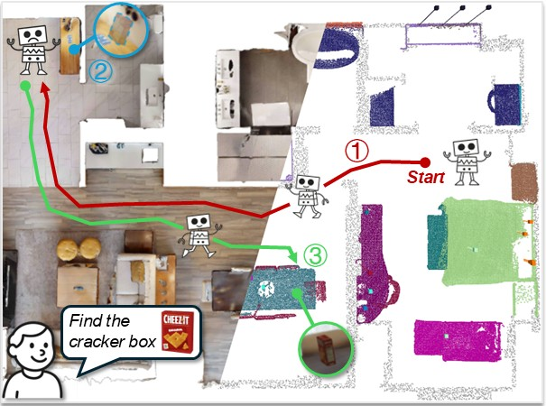
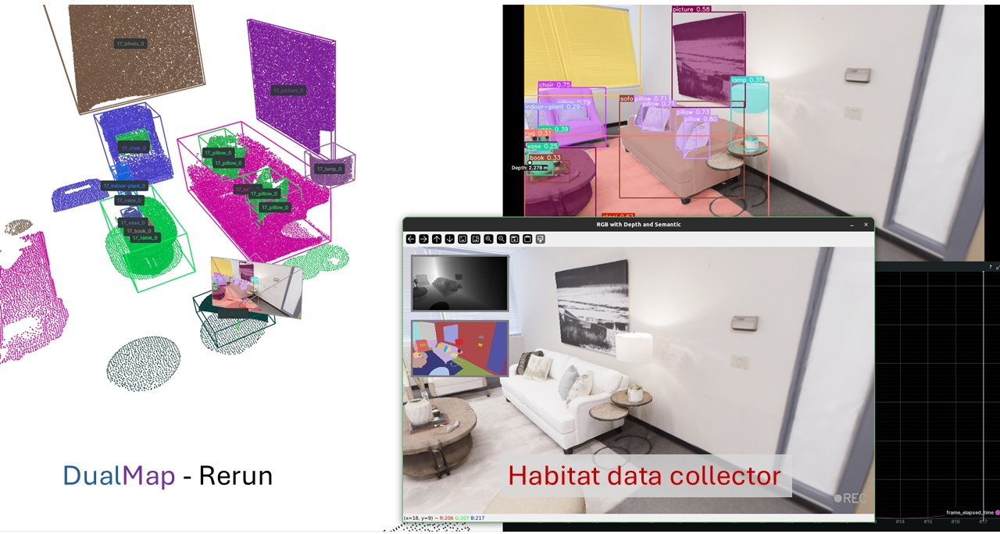
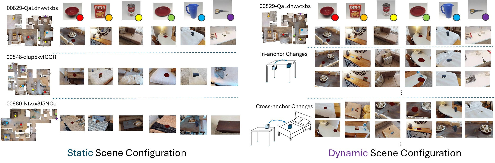
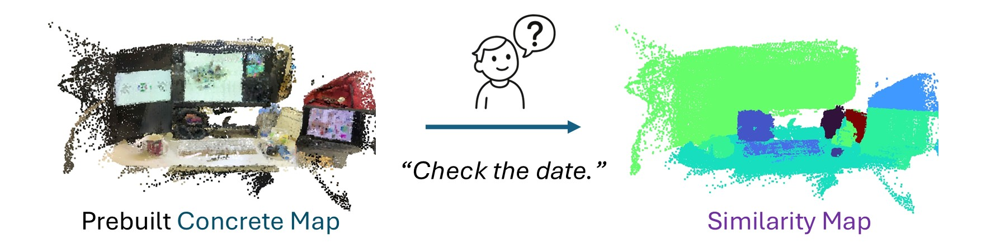

# DualMap
<h3>
  <a href="https://eku127.github.io/DualMap/">Project Page</a> |
  <a href="https://arxiv.org/abs/2506.01950">Paper</a> |
  <a href="https://youtu.be/ZmZDvhyXL_g">Video</a>
</h3>

<p align="center">
  
</p>


**DualMap** is an online open-vocabulary mapping system that enables robots to understand and navigate dynamic 3D environments using natural language.

The system supports multiple input sources, including offline datasets (**Dataset Mode**), ROS streams & rosbag files (**ROS Mode**), and iPhone video streams(**Record3d Mode**). We provide examples for each input type.

## Updates
**[2025.06]** We released the Offline Query Examples — check it out [here](#offline-map-query)

## Release Plan

- [x] Environment setup & dataset links  
- [ ] Full system code (Mapping + Navigation)
- [ ] Evaluation Code
- [ ] [Apps] Running with Datasets
- [ ] [Apps] Running with ROS 
- [ ] [Apps] Running with iPhone
- [x] [Apps] Offline Query
- [ ] Realworld Deployment Guidance

## Installation

> ✅ Tested on **Ubuntu 22.04** with **ROS 2 Humble** and **Python 3.10**

### 1. Clone the Repository (with submodules)

```bash
git clone --recurse-submodules git@github.com:Eku127/DualMap.git
cd DualMap
```
>  Make sure to use `--recurse-submodules` to get `mobileclip`.

### 2. Create Conda Environment
```bash
conda env create -f environment.yml
conda activate dualmap
```

### 3. Install MobileCLIP
```bash
cd 3rdparty/mobileclip
pip install -e . --no-deps
cd ../..
```

### (Optional) Setup ROS 2 Environment
Setting up ROS2 environment for ROS support and applications.
We recommend [ROS 2 Humble](https://docs.ros.org/en/humble/Installation.html).
Once installed, activate the environment:

```bash
source /opt/ros/humble/setup.bash
```

> DualMap’s navigation functionality and real-world integration are based on ROS 2. Installation is strongly recommended.

### (Optional) Setup Habitat Data Collector

<p align="center">
  
</p>


[Habitat Data Collector](https://github.com/Eku127/habitat-data-collector) is a tool built on top of the [Habitat-sim](https://github.com/facebookresearch/habitat-sim). It supports agent control, object manipulation, dataset and ROS bag recording, as well as navigation through external ROS topics. DualMap subscribes to live ROS topics from the collector for real-time mapping and language-guided querying, and publishes navigation trajectories for the agent to follow.

> For the best DualMap experience (especially navigation tests), **we strongly recommend setting up the Habitat Data Collector**. See [the repo](https://github.com/Eku127/habitat-data-collector) for installation and usage details.


## Dataset

### Replica & ScanNet

Please follow [this guide](resources/doc/replica&scannet.md) to download and prepare the public Replica and ScanNet datasets for use with DualMap.


### HM3D Dynamic Scene Data

<p align="center">
  
</p>


We release both static and dynamic HM3D scene data to support faithful reproduction of the results presented in the "Navigation in Simulation" section. Researchers can use this dataset to replicate both the static and dynamic environments evaluated in our experiments.

> The dataset includes three HM3D scenes tested in the paper.

You can download the data here:
🔗 [OneDrive](https://hkustgz-my.sharepoint.com/:f:/g/personal/jjiang127_connect_hkust-gz_edu_cn/ErSvH_QPouBLsHE0AzZAw0oBQFqRIjdrEOxAHN7OBO0nHg?e=PvmkUo)


#### Per-Scene Directory Structure
Each scene folder follows the structure below:

```
00829-QaLdnwvtxbs/                    # Example scene ID
├── data.zip                          # RGB-D + pose + intrinsic offline dataset (5.08 GB)
├── static_scene_config.json          # Static scene configuration
├── dynamic_scene_config/             # Dynamic scene configurations
│   ├── cross_anchor/                       
│   │   ├── 0128-1.json
│   │   └── ...
│   └── in_anchor/                          
│       ├── 0128-1.json
│       └── ...
├── global_map/                       # Prebuilt abstract map from rosbag and dataset
├── rosbag2_odom/                     # ROS2 bag of static scene traversal
├── class_bbox.json                   # Object bounding boxes (for evaluation)
├── class_num.json                    # Object class count summary (for evaluation)
```
See the **Applications** section for detailed dataset usage. The usage of **scene configuration** is documented in [Habitat Data Collector documentation](https://github.com/Eku127/habitat-data-collector/blob/main/documents/config_reference/config_reference.md#-scene-configuration).

## Applications

### Run with Datasets [TBD]
_Coming soon: Reproduce offline mapping results with Replica, ScanNet and self collected datasets._


### Run with ROS [TBD]
_Coming soon: Online mapping and navigation via live ROS topics from the Habitat Data Collector and real world robot._

### Run with iPhone [TBD]
_Coming soon: Real-time data streaming from Record3D to DualMap with open vocabulary semantic mapping._

### Offline Map Query
<p align="center">
  <a href="resources/doc/app_offline_query.md">
    
  </a>
</p>

We provide two prebuilt map examples for offline querying: one from iPhone data and one from Replica Room 0.

👉 Follow [this guide](resources/doc/app_offline_query.md) to run the query application.

### Visualization
_Coming soon: The system supports both Rerun and Rviz visualization_

## Evaluation [TBD]
Evaluation code and result reproduction tools will be released in future updates.
We ensure that you can reproduce all the results in our paper.

## Acknowledgment

We are grateful to the authors of [HOVSG](https://github.com/hovsg/HOV-SG) and [ConceptGraphs](https://github.com/concept-graphs/concept-graphs) for their contributions and inspiration.

Special thanks to @[TOM-Huang](https://github.com/Tom-Huang) for his valuable advice and support throughout the development of this project.

We also thank the developers of [MobileCLIP](https://github.com/apple/ml-mobileclip), [CLIP](https://github.com/openai/CLIP), [Segment Anything (SAM)](https://github.com/facebookresearch/segment-anything), [MobileSAM](https://github.com/ChaoningZhang/MobileSAM), [FastSAM](https://github.com/CASIA-IVA-Lab/FastSAM), and [YOLO-World](https://github.com/AILab-CVC/YOLO-World) for their excellent open-source work, which provided strong technical foundations for this project.