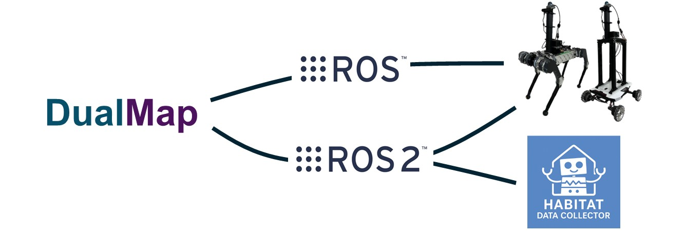
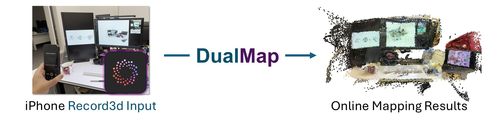
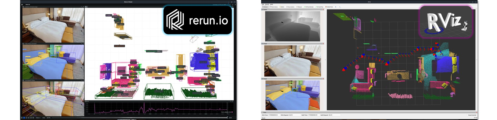

# DualMap
<h3>
  <a href="https://eku127.github.io/DualMap/">Project Page</a> |
  <a href="https://arxiv.org/abs/2506.01950">Arxiv</a> 
  <!-- <a href="https://youtu.be/ZmZDvhyXL_g">Video</a> -->
</h3>

<p align="center">
  
</p>


**DualMap** is an online open-vocabulary mapping system that enables robots to understand and navigate dynamic 3D environments using natural language.

The system supports multiple input sources, including offline datasets (**Dataset Mode**), ROS streams & rosbag files (**ROS Mode**), and iPhone video streams(**Record3d Mode**). We provide examples for each input type.

## Updates

**[2025.08]** Release [Run with Dataset Guide](#run-with-datasets), [Run with ROS Guide](#run-with-ros), Evaluation Code, and Full System Code.

**[2025.06]** Release the Offline Query Examples — check it out [here](#offline-map-query)


## Release Plan

- [x] Environment Setup
- [x] Full System Code
- [x] Evaluation Code
- [x] [Apps] Running with Datasets
- [x] [Apps] Running with ROS 
- [ ] [Apps] Running with iPhone
- [ ] [Apps] Navigation in Simulation
- [x] [Apps] Offline Query
- [ ] Realworld Deployment Guidance

## Installation

> ✅ Tested on **Ubuntu 22.04** with **ROS 2 Humble** and **Python 3.10**

### 1. Clone the Repository (with submodules)

```bash
git clone --branch main --single-branch --recurse-submodules git@github.com:Eku127/DualMap.git
cd DualMap
```
>  Make sure to use `--recurse-submodules` to get `mobileclip`.

### 2. Create Conda Environment
```bash
conda env create -f environment.yml
conda activate dualmap
```

### 3. Install MobileCLIP
```bash
cd 3rdparty/mobileclip
pip install -e . --no-deps
cd ../..
```

### (Optional) Setup ROS 2 Environment
Setting up ROS2 environment for ROS support and applications.
We recommend [ROS 2 Humble](https://docs.ros.org/en/humble/Installation.html).
Once installed, activate the environment:

```bash
source /opt/ros/humble/setup.bash
```

> DualMap’s navigation functionality and real-world integration are based on ROS 2. Installation is strongly recommended.

> **ROS1 noetic** is also supported, you can setup the ROS 1 in Ubuntu 22.04 by follow [this guide](resources/doc/ros_communication.md).

### (Optional) Setup Habitat Data Collector

<p align="center">
  
</p>


[Habitat Data Collector](https://github.com/Eku127/habitat-data-collector) is a tool built on top of the [Habitat-sim](https://github.com/facebookresearch/habitat-sim). It supports agent control, object manipulation, dataset and ROS2 bag recording, as well as navigation through external ROS2 topics. DualMap subscribes to live ROS2 topics from the collector for real-time mapping and language-guided querying, and publishes navigation trajectories for the agent to follow.

> For the best DualMap experience (especially navigation tests), **we strongly recommend setting up the Habitat Data Collector**. See [the repo](https://github.com/Eku127/habitat-data-collector) for installation and usage details.


## Dataset

### Replica & ScanNet

Please follow [this guide](resources/doc/data_replica_scannet.md) to download and arrange the public Replica and ScanNet datasets for use with DualMap.


### HM3D Self-collected Data

We manually collected data in three HM3D scenes to support static and dynamic object navigation. Please follow [this guide](resources/doc/data_hm3d_self_collected.md) to download and arrange the self-collected HM3D data. 

### Dataset Structure
We recommend placing the data in the `dataset` folder within this repository.
The final `dataset` structure should look like this:
```
dataset/
├── Replica/
│   ├── office0/
│   │   ├── results/              # RGB-D frames (depth + RGB)
│   │   └── traj.txt              # Trajectory file
│   ├── office1/
│   ├── ...
│   └── room2/
│
├── Replica-Dataset/
│   └── Replica_original/
│       ├── apartment_0/
│       ├── room_0/
│       │   └── habitat/
│       │       └── mesh_semantic.ply
│       └── ...
│
├── scannet/
│   └── exported/                  # exported ScanNet data
│       ├── scene0010_00/
│       │   ├── color/             # Exported color images
│       │   ├── depth/             # Exported depth maps
│       │   ├── intrinsic/         # Camera intrinsics
│       │   └── pose/              # Camera poses
│       ├── scene0050_00/
│       └── ...
│
├── scannet200/
│   ├── train/
│   └── val/
│       ├── scene0011_00.ply
│       └── ...
│
└── HM3D_collect/
```


## Applications

### Run with Datasets

DualMap supports running with **offline datasets**. Currently supported datasets include:
1. Replica Dataset  
2. ScanNet Dataset  
3. TUM RGB-D Dataset  
4. Self-collected data using [Habitat Data Collector](https://github.com/Eku127/habitat-data-collector)  

👉 Follow [Dataset usage guide](resources/doc/app_runner_dataset.md) to run DualMap with these datasets and reproduce our offline mapping results in our paper.


### Run with ROS
<p align="center">
    
</p>

DualMap supports input from both **ROS1** and **ROS2**.  
You can run the system with **offline rosbags** or in **online mode** with real robots.

👉 Follow the [ROS usage guide](resources/doc/app_runner_ros.md) to get started with running DualMap using ROS1/ROS2 rosbags or live ROS streams.
<!-- #### ROS1 Bridge
This system can also work with **ROS1 Noetic** by using the `ros1_bridge`.

To set up the bridge between **ROS1 Noetic** and **ROS2 Humble** on **Ubuntu 22.04**, follow the instructions in [this guide](resources/doc/ros_communication.md). All commands have been tested and confirmed to work. -->

### Run with iPhone [TBD]
<p align="center">
    
</p>

_Coming soon: Real-time data streaming from Record3D to DualMap with open vocabulary semantic mapping._

### Offline Map Query
<p align="center">
  <a href="resources/doc/app_offline_query.md">
    
  </a>
</p>

We provide two prebuilt map examples for offline querying: one from iPhone data and one from Replica Room 0.

👉 Follow [this guide](resources/doc/app_offline_query.md) to run the query application.

### Visualization
<p align="center">
    
</p>

_Coming soon: The system supports both Rerun and Rviz visualization_


## Citation

If you find our work helpful, please consider starring this repo 🌟 and cite:

```bibtex
@article{jiang2025dualmap,
  title={DualMap: Online Open-Vocabulary Semantic Mapping for Natural Language Navigation in Dynamic Changing Scenes},
  author={Jiang, Jiajun and Zhu, Yiming and Wu, Zirui and Song, Jie},
  journal={arXiv preprint arXiv:2506.01950},
  year={2025}
}
```

## Acknowledgment

We are grateful to the authors of [HOVSG](https://github.com/hovsg/HOV-SG) and [ConceptGraphs](https://github.com/concept-graphs/concept-graphs) for their contributions and inspiration.

Special thanks to @[TOM-Huang](https://github.com/Tom-Huang) for his valuable advice and support throughout the development of this project.

We also thank the developers of [MobileCLIP](https://github.com/apple/ml-mobileclip), [CLIP](https://github.com/openai/CLIP), [Segment Anything (SAM)](https://github.com/facebookresearch/segment-anything), [MobileSAM](https://github.com/ChaoningZhang/MobileSAM), [FastSAM](https://github.com/CASIA-IVA-Lab/FastSAM), and [YOLO-World](https://github.com/AILab-CVC/YOLO-World) for their excellent open-source work, which provided strong technical foundations for this project.