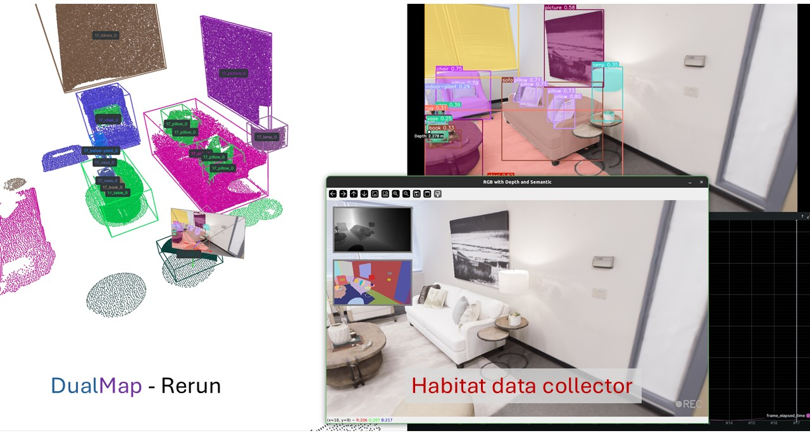

# DualMap
<h3>
  <a href="https://eku127.github.io/DualMap/">Project Page</a> |
  <a href="https://arxiv.org/abs/2103.xxxx">Paper</a> |
  <a href="https://youtu.be/ZmZDvhyXL_g">Video</a>
</h3>

<p align="center">
  
</p>


**DualMap** is an online open-vocabulary mapping system that enables robots to understand and navigate dynamic 3D environments using natural language. 

The system supports multiple input sources, including offline datasets (**Dataset Mode**), ROS streams & rosbag files (**ROS Mode**), and iPhone video streams(**Record3d Mode**). We provide examples for each input type.

## Updates
**[2025.06]** Full code release is coming soon—stay tuned!

## Release Plan

- [ ] Environment setup & dataset links  
- [ ] Full system code (Mapping + Navigation)
- [ ] Evaluation Code
- [ ] [Examples] Running with Datasets
- [ ] [Examples] Running with ROS 
- [ ] [Examples] Running with iPhone
- [ ] [Examples] Offline Query
- [ ] [Examples] Realworld Deployment Guidance

## Installation

> ✅ Tested on **Ubuntu 22.04** with **ROS 2 Humble** and **Python 3.10+**

### 1. Clone the Repository (with submodules)

```bash
git clone --recurse-submodules git@github.com:Eku127/DualMap.git
cd DualMap
```

>  Cloning may take some time, especially for Habitat-related submodules. If you forget `--recurse-submodules`, you can initialize them manually:

```bash
git submodule update --init --recursive
```

### 2. Create Conda Environment
```bash
conda env create -f environment.yml
conda activate dualmap
```

### 3. Install MobileCLIP
```bash
cd 3rdparty/mobileclip
pip install -e . --no-deps
```

### (Optional) Setup ROS 2 Environment
Setting up ROS2 environment for ROS support and applications.
We recommend [ROS 2 Humble](https://docs.ros.org/en/humble/Installation.html).
Once installed, activate the environment:

```bash
source /opt/ros/humble/setup.bash
```

### (Optional) Setup Habitat Data Collector

<p align="center">
  
</p>


[Habitat Data Collector](https://github.com/Eku127/habitat-data-collector) is a tool built on top of the [Habitat-sim](https://github.com/facebookresearch/habitat-sim). It supports agent control, object manipulation, dataset and ROS bag recording, as well as navigation through external ROS topics. DualMap subscribes to live ROS topics from the collector for real-time mapping and language-guided querying, and publishes navigation trajectories for the agent to follow.

> For the best DualMap experience, **we strongly recommend setting up the Habitat Data Collector**. See [the repo](https://github.com/Eku127/habitat-data-collector) for installation and usage details.


## Dataset

### Replica & ScanNet

### HM3D Dynamic Scene Data
We release both static and dynamic HM3D scene data to support faithful reproduction of the results presented in the "Navigation in Simulation" section. Researchers can use this dataset to replicate both the static and dynamic environments evaluated in our experiments.

> The dataset includes three HM3D scenes tested in the paper.

You can download the data here:
🔗 [OneDrive](https://hkustgz-my.sharepoint.com/:f:/g/personal/jjiang127_connect_hkust-gz_edu_cn/ErSvH_QPouBLsHE0AzZAw0oBQFqRIjdrEOxAHN7OBO0nHg?e=PvmkUo)


#### Per-Scene Directory Structure
Each scene folder follows the structure below:

```
00829-QaLdnwvtxbs/                    # Example scene ID
├── data.zip                          # RGB-D + pose + intrinsic offline dataset (5.08 GB)
├── static_scene_config.json          # Static scene configuration
├── dynamic_scene_config/             # Dynamic scene configurations
│   ├── cross_anchor/                       
│   │   ├── 0128-1.json
│   │   └── ...
│   └── in_anchor/                          
│       ├── 0128-1.json
│       └── ...
├── global_map/                       # Prebuilt abstract map from rosbag and dataset
│   └── ...
├── rosbag2_odom/                     # ROS bag of static scene traversal
│   └── ...
├── class_bbox.json                   # Object bounding boxes (for evaluation)
├── class_num.json                    # Object class count summary (for evaluation)
```
See the **Examples** section for detailed dataset usage. The usage of scene configuration is documented in [Habitat Data Collector documentation](https://github.com/Eku127/habitat-data-collector/blob/main/documents/config_reference/config_reference.md#-scene-configuration).

## Examples

## Evaluation
TBD

