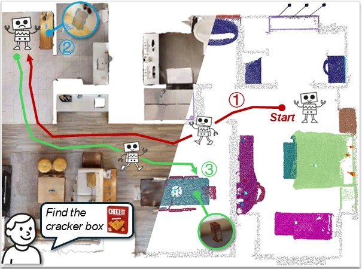

# DualMap
[[Project Page]](https://eku127.github.io/DualMap/) [[Paper]](https://arxiv.org/abs/2103.xxxx) 

  

DualMap s an online open-vocabulary mapping system that helps robots understand and navigate dynamic 3D environments with natural language. By combining a global abstract map for planning and a local concrete map for execution, it handles scene changes in real time. With efficient object tracking and segmentation, DualMap skips expensive 3D merging and enables fast, accurate navigation in both simulation and the real world.
