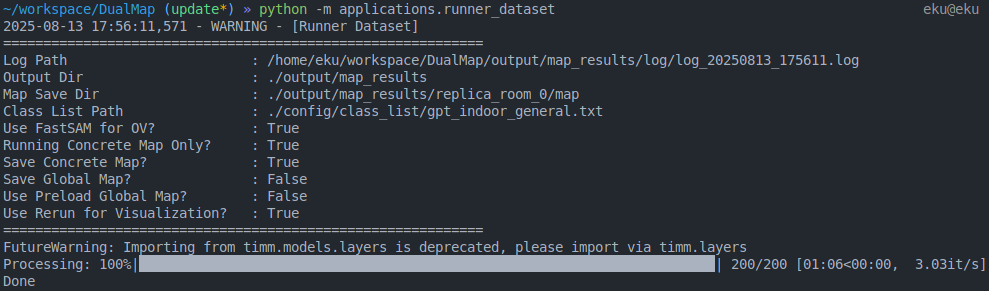

# Running with Dataset

> **Note:** Before running DualMap with a dataset, please ensure the dataset is arranged in the correct directory structure.

## Run
First activate the conda environment
```
conda activcate dualmap
```

Then, navigate to the repository root and run the application:
```
cd DualMap
python -m applications.runner_dataset
```

You will see the **Rerun** visualization window pop up, and the system will run with the Replica `room_0` sequence by default.
After the run finishes, you can check the `output` directory for the results, which are organized as follows:

```
output/                                 # Root output directory 
└── map_results/                        # Output folder assigned in base_config.yaml
    ├── log/                            # Running logs
    │   └── log_20250813_162449.log
    └── replica_room_0/                 # Processed dataset_scene_id
        ├── detections/                 # Saved detection results if save_detection is enabled
        ├── map/                        # Maps saved by DualMap
        │   ├── 0e5ea11d.pkl            # Object information
        │   ├── ...
        │   ├── 2cd13570.pkl
        │   ├── layout.pcd              # Layout point cloud
        ├── detector_time.csv           # Time breakdown for observation generation
        └── system_time.csv             # Time breakdown for overall system run
```

The terminal screenshot of finishing the running will be like this:
<p align="center">
    
</p>

## Key Configurations
The `runner_dataset` application involves three key configurations:
1. `config/base_config.yaml`
2. `config/runner_dataset.yaml`
3. `config/system_config.yaml`

Below, we highlight the key configuration parameters related to the `runner_dataset` — in other words, the settings you are most likely to modify in the future. For more details, refer to the comments in the configuration files.


### Base Config
General dataset configurations. Four example settings are provided in `base_config.yaml` for your reference.

- **`dataset_name`** — Dataset name; determines which dataset loader DualMap uses  
- **`scene_id`** — ID of the scene to run  
- **`dataset_path`** — Path to the dataset  
- **`dataset_conf_path`** — Dataset config file; use as a template to create your own  
- **`dataset_gt_path`** — Ground truth path for evaluation  


- **`output_path`** is the parameter you will most often modify. It specifies the output directory for the DualMap system.  
    > **Note:** Each run will clear all existing files in output directory. If you plan to run the system multiple times, make sure to change this path accordingly.

### Runner Dataset Config

- **`visualize_detection`** — Enables viewing detection results via Rerun. This will slow down the system’s runtime performance.

- **`use_fastsam`** — Enables open-vocabulary segmentation with FastSAM. Segments generated by FastSAM will be labeled as `unknown`.

- **`use_rerun`** — Enables Rerun visualization. Most of DualMap’s visualizations are displayed via Rerun. If you are not running performance tests, it is recommended to keep Rerun enabled as your visualization tool.

- **`run_local_mapping_only`** — If set to `true`, runs the code using only the local (concrete) map with no abstraction process. Recommended to enable when running segmentation evaluation.

- **`save_local_map`** — Saves the objects in the local map to the output path for further evaluation and offline queries.   Recommended to enable when running segmentation evaluation.

### System Config
- **`yolo.given_classes_path`** - the class list used by YOLO. for all the indoor dataset we use `gpt_indoor_general.txt` as class list


## Evaluation

Running the evaluation to reproduce the results in Table II in the paper!

### Evaluate Single Scene
After running `runner_dataset` with the default settings, you will get the output concrete map in Replica `room_0`.

Next, without changing any configuration, run the following command to generate class colors for Replica dataset evaluation:
```
python -m applications.generate_replica_class_color
```
> **Note**: For ScanNet, you do not need to run this class color generation script.

Finally, run the evaluation script. It will evaluate the saved concrete map based on the settings in `base_config.yaml`:
```
python -m evaluation.sem_seg_eval
```
After successfully running the evaluation, you will see the output metrics. For `room_0`, **FmIoU** is around `0.75`, **mAcc** is around `0.54`, and **mIoU** is around `0.37`.

You can also find the results in `{output_path}/eval/results.json`.

> For ScanNet, update the settings in `base_config.yaml`. After successfully running the mapping, follow the same evaluation process as above.

### Evaluate the Whole Dataset
We provide scripts to run and evaluate the entire dataset for both Replica and ScanNet.

1. Set the correct dataset path and configuration file in `base_config.yaml`.  
2. Configure the parameters you want to test in `runner_dataset.yaml` and `system_config.yaml`.  
3. Run the corresponding script:

   - **Replica**:  
     ```bash
     bash scripts/dualmap_replica.sh
     ```

   - **ScanNet**:  
     ```bash
     bash scripts/dualmap_scannet.sh
     ```

After finishing the script run, all evaluation results from all scenes will be saved in `output_path`.

To get aggregated results, run:
```
python scripts/save_as_xlsx.py --dataset ${dataset_name} --eval_path ${output_path}/eval
```
Make sure to replace `${dataset_name}` and `${output_path}` with the actual parameter values you used. 

## Offline Query

After running and saving the concrete map, you can simply run the following command to perform an offline query.
```
python -m applications.offline_local_map_query
```

The map loaded during the query is determined by the settings in `base_config.yaml`.  
For more details, please refer to [this guide](./app_offline_query.md).


## Troubleshooting

#### Runner -> ERROR - [Detector][Init] Error loading CLIP model

> ERROR - [Detector][Init] Error loading CLIP model: Failed to download file (open_clip_pytorch_model.bin) for apple/MobileCLIP-S2-OpenCLIP. Last error: (MaxRetryError("HTTPSConnectionPool(host='huggingface.co', port=443)

This error may also lead to `AttributeError: 'Detector' object has no attribute 'fastsam/yolo'`. The root cause is that the current machine cannot connect to `huggingface.co`. Since our CLIP implementation uses the OpenCLIP library and relies on weights downloaded from Hugging Face, the absence of a connection will trigger this error. 

To resolve it, enable a proxy so that the machine can connect to `huggingface.co` and download the required weights.

Further, you can also try to load local CLIP weights, please refer to [this link](https://github.com/mlfoundations/open_clip?tab=readme-ov-file#loading-models) for more information.


#### Evaluation-> Error: File not found: replica_room_0_id_names.json

> FileNotFoundError: Error: File not found: ./output/map_results/replica_room_0/classes_info/replica_room_0_id_names.json

This error occurs when running the Replica dataset evaluation without first generating the class color file.  
Make sure to run the following command **before** executing `python -m evaluation.sem_seg_eval`:
```
python -m applications.generate_replica_class_color
```

