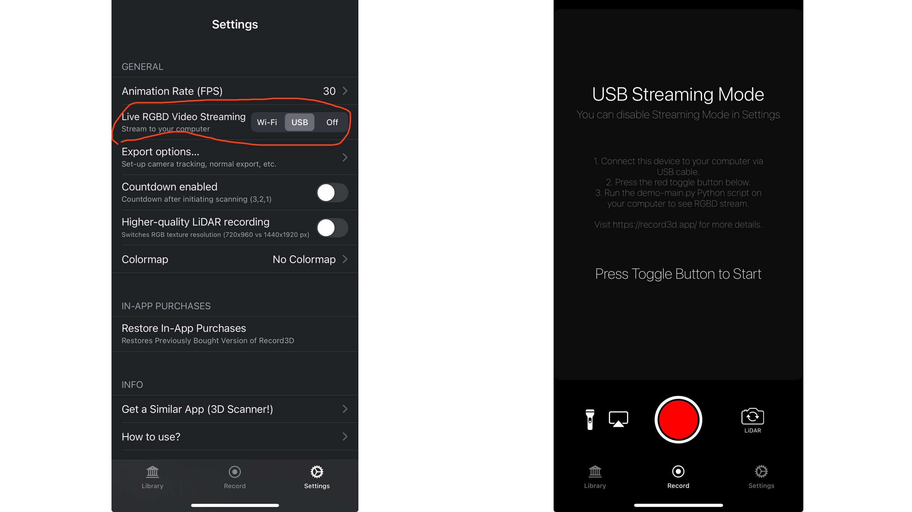

# Running with iPhone

<p align="center">
    
</p>

## 📚 Table of Contents
- [Prerequisites](#prerequisites)
- [Start Running](#start-running)
- [Troubleshooting](#troubleshooting)


## Prerequisites

1. Download the **Record3D** app on your iPhone.  
2. Set **Live RGBD Video Streaming** to **USB** mode.

<p align="center">
    
</p>

3. Connect your iPhone to your computer with a USB cable.


## Start Running

Make sure your iPhone is properly connected, then run the following commands:

```bash
cd DualMap
conda activate dualmap

python -m applications.runner_record_3d
```

Then click the **red start button** in the Record3D app — the system will start mapping.

https://github.com/user-attachments/assets/de6f1949-9204-434a-8b1b-295a641e6db7

## Troubleshooting
**Error:**
```
RuntimeError: Cannot connect to device #0, try a different index.
```
✅ **Solution:**  
- Check the USB connection to your iPhone.  
- Ensure that the Record3D app is running and set to **USB** mode.  
- Try using a different USB cable, as unstable or incompatible cables can cause connection issues.  