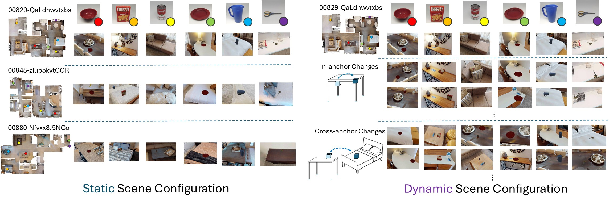

# HM3D Self-collected Data

<p align="center">
  
</p>


We release both static and dynamic HM3D scene data to support faithful reproduction of the results presented in the "Navigation in Simulation" section. Researchers can use this dataset to replicate both the static and dynamic environments evaluated in our experiments.

> The dataset includes three HM3D scenes tested in the paper.

You can download the data here:
🔗 [OneDrive](https://hkustgz-my.sharepoint.com/:f:/g/personal/jjiang127_connect_hkust-gz_edu_cn/ErSvH_QPouBLsHE0AzZAw0oBQFqRIjdrEOxAHN7OBO0nHg?e=PvmkUo)


## Per-Scene Directory Structure
Each scene folder follows the structure below:

```
00829-QaLdnwvtxbs/                    # Example scene ID
├── data.zip                          # RGB-D + pose + intrinsic offline dataset (5.08 GB)
├── static_scene_config.json          # Static scene configuration
├── dynamic_scene_config/             # Dynamic scene configurations
│   ├── cross_anchor/                       
│   │   ├── 0128-1.json
│   │   └── ...
│   └── in_anchor/                          
│       ├── 0128-1.json
│       └── ...
├── global_map/                       # Prebuilt abstract map from rosbag and dataset
├── rosbag2_odom/                     # ROS2 bag of static scene traversal
├── class_bbox.json                   # Object bounding boxes (for evaluation)
├── class_num.json                    # Object class count summary (for evaluation)
```

If you want to run the DualMap with dataset mode, you need to unzip the `data.zip` to get the `rgb/`, `depth/` and `pose.txt`.

See the **Applications** section for further detailed dataset usage. The usage of **scene configuration** is documented in [Habitat Data Collector documentation](https://github.com/Eku127/habitat-data-collector/blob/main/documents/config_reference/config_reference.md#-scene-configuration).