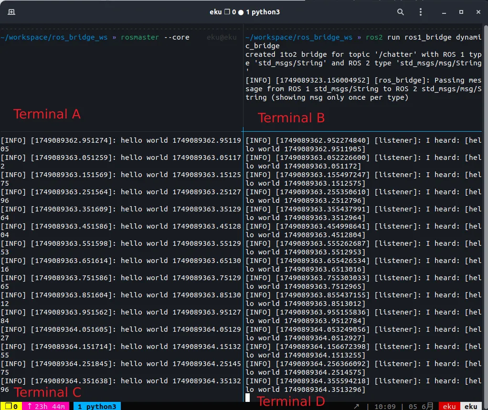
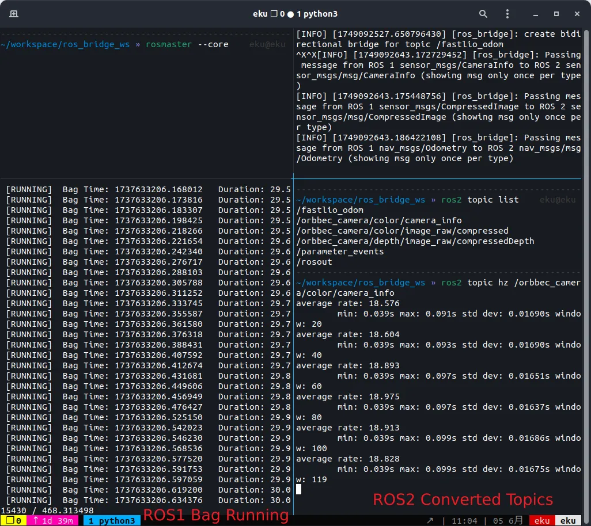

# ROS2 <-> ROS1 Communication on Ubuntu 22.04
This guide provides a concise walkthrough for enabling communication between ROS2 (Humble) and ROS1 (Noetic) under Ubuntu 22.04. It includes environment setup, building the `ros1_bridge`, and customizing topic bridging behavior. [Chinese Tutorial](https://www.yuque.com/u21262689/fxzc7g/xk5h3kfphnw5sf6x?singleDoc#)

## Environment Setup
### Install ROS2 (Humble)
Follow the official [installation guide](https://docs.ros.org/en/humble/Installation.html)

### Install ROS1 (Noetic)
```bash
echo "deb [trusted=yes arch=amd64] http://deb.repo.autolabor.com.cn jammy main" | sudo tee /etc/apt/sources.list.d/autolabor.list
sudo apt update
sudo apt install ros-noetic-autolabor
```
Verify with:
```bash
source /opt/ros/noetic/setup.zsh
roscore
```

## Building the ROS1 <-> ROS2 Bridge
### Clone and Prepare Workspace
```bash
mkdir -p ~/ros_bridge_ws/src && cd ~/ros_bridge_ws/src
git clone https://github.com/Eku127/ros1_bridge.git
```
> If colcon is not installed, install first:
> `sudo apt install python3-colcon-common-extensions`

> This fork contains custom bridge implementations (e.g., for `compressedImage`).

### Compile the Workspace
```bash
cd ~/ros_bridge_ws

# First pass (skip ros1_bridge)
colcon build --symlink-install --packages-skip ros1_bridge

# Source both ROS environments
source /opt/ros/noetic/setup.zsh
source /opt/ros/humble/setup.zsh

# Build ros1_bridge
colcon build --symlink-install --packages-select ros1_bridge --cmake-force-configure --event-handlers console_direct+
```

## Run and Test the Bridge
Setup four terminals for testing

**Terminal A**
```bash
source /opt/ros/noetic/setup.zsh
rosmaster --core
```
> `roscore` is fine, but will have `/rosout` warning during running time

**Terminal B**
```bash
source /opt/ros/noetic/setup.zsh
source /opt/ros/humble/setup.zsh

# or source the build dir
cd workspace/ros_bridge_ws
source install/setup.sh

export ROS_MASTER_URI=http://localhost:11311
ros2 run ros1_bridge dynamic_bridge
```

**Terminal C - ROS1 Chatter**
```bash
source /opt/ros/noetic/setup.zsh
rosrun rospy_tutorials talker
```

**Terminal D - ROS2 Listener**
```bash
source /opt/ros/humble/setup.zsh
ros2 run demo_nodes_cpp listener
```

If running success, you will see the following
<p align="center">
    
</p>

## Selective Topic Bridging with `static_bridge`
Using `dynamic_bridge` will publish all available topics, which may be inefficient and unnecessary.

To limit bridging to specific topics (e.g., `compressedImage`), you can customize `static_bridge.cpp`: [Example: static_bridge.cpp L43–L48](https://github.com/ros2/ros1_bridge/blob/3d5328dc21564d2130b4ded30afe5cd1c41cf033/src/static_bridge.cpp#L43C2-L48C1)

My fork already includes a compiled version `static_bridge_compressed`.

Run it with:

```bash
ros2 run ros1_bridge static_bridge_compressed
```
Then play a ROS1 bag file in another terminal. You should observe that the selected topics are now bridged to ROS2.
<p align="center">
    
</p>

## Decompressing Compressed Topics
### RGB Image Topics

For RGB image topics (e.g., `/camera/image/compressed`), decompression is straightforward using `cv_bridge` or similar tools.

### Depth Image Topics

For depth images, do not decompress `/depth/image_raw/compressed` directly — the result is 8-bit int8 data, which is incorrect.

Instead, decompress this topic:
```
/depth/image_raw/compressedDepth
```
Reference:

[ROS Answers - Decompressing Depth](https://answers.ros.org/question/249775/)

This topic encodes 16-bit depth values correctly.

### Example code 

Here we present an example code for decompressing.

```Python
import rclpy
from rclpy.node import Node
from sensor_msgs.msg import CompressedImage
import cv2
import numpy as np
import os

import struct

class ImageSaverNode(Node):
    def __init__(self):
        super().__init__('image_saver_node')

        self.rgb_dir = "./rgb"
        self.depth_dir = "./depth"
        os.makedirs(self.rgb_dir, exist_ok=True)
        os.makedirs(self.depth_dir, exist_ok=True)

        self.rgb_sub = self.create_subscription(
            CompressedImage,
            '/orbbec_camera/color/image_raw/compressed',
            self.rgb_callback,
            10
        )

        self.depth_sub = self.create_subscription(
            CompressedImage,
            '/orbbec_camera/depth/image_raw/compressedDepth',
            self.depth_callback,
            10
        )

        self.rgb_idx = 0
        self.depth_idx = 0

        self.get_logger().info("ImageSaverNode started. Listening to image topics...")

    def decompress_image(self, msg, is_depth=False):

        msg_data = bytes(msg.data)

        if is_depth:
            depth_header_size = 12
            raw_header = msg_data[:depth_header_size]
            depth_data = np.frombuffer(msg_data[depth_header_size:], np.uint8)

            depth_img_raw = cv2.imdecode(depth_data, cv2.IMREAD_UNCHANGED)
            if depth_img_raw is None:
                self.get_logger().warn("Failed to decode compressed depth image.")
                return None

            img = depth_img_raw  # chekc msg.format, if 16uc1, save directly

        else:
            np_arr = np.frombuffer(msg_data, np.uint8)
            img = cv2.imdecode(np_arr, cv2.IMREAD_COLOR)

            if img is None:
                self.get_logger().warn("Failed to decode RGB image.")

        return img

    def rgb_callback(self, msg):
        img = self.decompress_image(msg, is_depth=False)
        if img is None or img.size == 0:
            self.get_logger().warn(f"Failed to decode RGB image {self.rgb_idx}")
            return

        filename = os.path.join(self.rgb_dir, f"rgb_{self.rgb_idx:06d}.png")
        cv2.imwrite(filename, img)
        self.get_logger().info(f"Saved RGB image: {filename}")
        self.rgb_idx += 1

    def depth_callback(self, msg):
        img = self.decompress_image(msg, is_depth=True)
        if img is None or img.size == 0:
            self.get_logger().warn(f"Failed to decode Depth image {self.depth_idx}")
            return

        if img.dtype != np.uint16:
            img = (img * 1000).astype(np.uint16)  # if float32，convert to uint16

        filename = os.path.join(self.depth_dir, f"depth_{self.depth_idx:06d}.png")
        cv2.imwrite(filename, img)
        self.get_logger().info(f"Saved Depth image: {filename}")
        self.depth_idx += 1

def main(args=None):
    rclpy.init(args=args)
    node = ImageSaverNode()
    try:
        rclpy.spin(node)
    except KeyboardInterrupt:
        node.get_logger().info("Shutting down ImageSaverNode...")
    finally:
        node.destroy_node()
        rclpy.shutdown()

if __name__ == '__main__':
    main()
```
